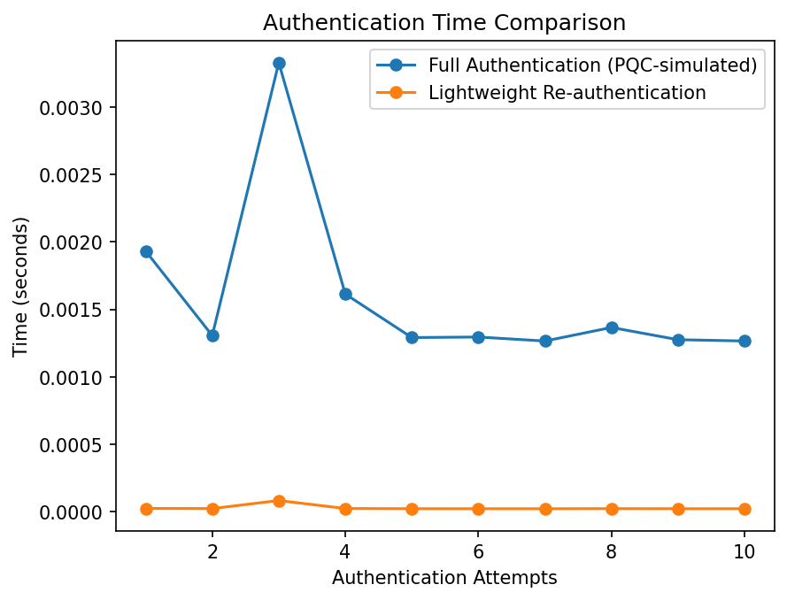

# Lightweight Re-Authentication Framework for Internet of Drones (IoD) using PQC

A Python-based simulation demonstrating a lightweight re-authentication mechanism for UAV/drone networks, based on the research paper *"A Lightweight Re-Authentication Framework for Internet of Drones using Post-Quantum Cryptography"* presented at a National Seminar, University of Delhi.

## Problem

In Internet of Drones (IoD) systems, drones frequently disconnect and reconnect due to unstable connectivity. Performing full post-quantum authentication (e.g., Dilithium signatures + Kyber key exchange) on every reconnection introduces high computational and communication overhead — inefficient for resource-constrained UAVs.

## Approach

This project proposes a two-phase authentication framework:

1. **Initial Authentication** — Full authentication is performed once per session (conceptually modeled on PQC primitives — Dilithium for signature verification, Kyber for key establishment, as detailed in the accompanying research paper).
2. **Lightweight Re-authentication** — Subsequent reconnections use hash-based session token verification (SHA-256) instead of repeating expensive cryptographic operations, significantly reducing authentication overhead.

> **Note:** This repository contains a Python simulation modeling the *relative computational cost* between full and lightweight authentication using a hash-based proxy. It demonstrates the performance improvement of the proposed architecture rather than a full cryptographic implementation of Kyber/Dilithium.

## Files

| File | Description |
|---|---|
| `auth_simulation.py` | Simulates initial full authentication between drone and ground control station |
| `reauth_simulation.py` | Implements lightweight re-authentication using hash-based session tokens |
| `performance_graph.py` | Benchmarks and compares authentication time across 10 authentication attempts |

## Results

Simulation run over 10 authentication attempts:

| Metric | Full Authentication | Lightweight Re-authentication |
|---|---|---|
| Average Time | 0.001594 sec | 0.000028 sec |
| **Overhead Reduction** | — | **98.25%** |



The lightweight re-authentication mechanism reduces authentication overhead by **98.25%** compared to full authentication, making the approach well-suited for real-world drone networks with frequent reconnections.

## Tech Stack

- Python
- hashlib (SHA-256)
- matplotlib

## How to Run

```bash
pip install matplotlib
python performance_graph.py
```

## Research Paper

This implementation accompanies the paper *"A Lightweight Re-Authentication Framework for Internet of Drones using Post-Quantum Cryptography,"* presented at a National Seminar, College of Vocational Studies, University of Delhi.

## Future Work

- Full implementation of Kyber (key encapsulation) and Dilithium (digital signatures)
- Formal security verification using tools such as AVISPA or ProVerif
- Testing under real network simulation (e.g., NS-3 or Mininet)
